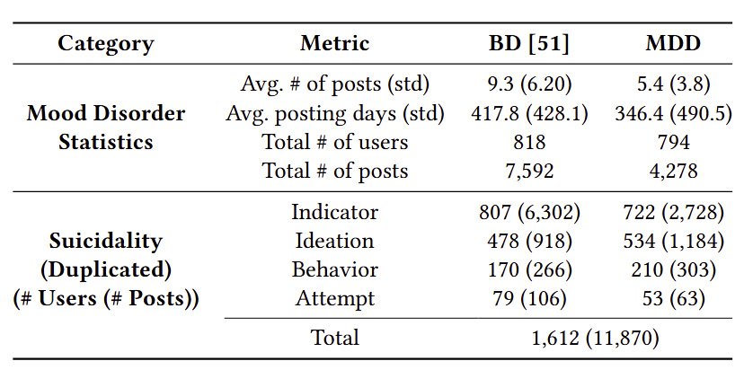

# Mood-Risk

## Mood-Risk: A Dataset for Future Suicidality Detection in Mood Disorders on Social Media
This codebase contains the python scripts for the model for the Mood-Risk.

## Environment & Installation Steps
Python 3.8 & Pytorch 1.12
```
pip install -r requirements.txt
```

## Run
Execute the following steps in the same environment:
```
cd Mood-Risk & python Mood-Risk.py
```

## Dataset Format
Processed dataset format should be a DataFrame as a .pkl file having the following columns:

1. user_id : unique user id
2. post_id : unique post id
3. past_6_su : suicidality(e.g., indicator) type
4. body_pre : original post
5. mh_diag : diagnosis type 0(MDD) and 1(BD)
6. time : unique posting time
7. fu_30_su : suicidality after 30 days
8. mh_prob : diagnosis probability (e.g., 0(MDD), 1(BD)
9. sum_w_mh : summarziation data with mental health

## Annotation Process
To label the collected Reddit dataset, we recruited three researchers, who are knowledgeable in psychology and fluent in English, as annotators. With the supervision of a psychiatrist, the trained annotators labeled 794 users and their 4,278 anonymized Reddit posts using the open-source text annotation tool Doccano. During annotations, we mainly consider two different label categories: (i) Mental disorder diagnosis type (e.g., MDD, BD) and (ii) suicidality levels (e.g., ideation, attempt). If there is any conflict in the annotated labels across the annotators, all the annotators discuss and reach to an agreement under the supervision of the psychiatrists. 



## Ethical Concerns
We carefully consider potential ethical issues in this work: (i) protecting users' privacies on Reddit and (ii) avoiding potentially harmful uses of the proposed dataset. The Reddit privacy policy explicitly authorizes third parties to copy user content through the Reddit API. We follow the widely-accepted social media research ethics policies that allow researchers to utilize user data without explicit consent if anonymity is protected (benton et al. 2017; Williams et al., 2017). Any metadata that could be used to specify the author was not collected. In addition, all content is manually scanned to remove personally identifiable information and mask all the named entities. More importantly, the BD dataset will be shared only with other researchers who have agreed to the ethical use of the dataset.

## How to Request Access
While it is important to ensure that all necessary precautions are taken, we are enthusiastic about sharing this valuable resource with fellow researchers. To request access to the dataset, please contact Daeun Lee (delee12@skku.edu). Access requests should follow the format of the sample application provided below, which consists of three parts:
- Part 0: Download a sample application form 
- Part 1: Applicant Information
- Part 2: Dataset Access Application
- Part 3: Ethical Review by Your Organization

The dataset was produced at Sungkyunkwan University (SKKU) in South Korea. This exemption applies to the analysis of pre-existing data that is publicly accessible or involves individuals who cannot be directly identified or linked to identifiable information. Nevertheless, due to the potentially sensitive nature of this data, we require that researchers who receive the data obtain ethical approval from their respective organizations.

Please submit your access request to Daeun Lee (da-eun.lee@yale.edu) and ensure that you include all the necessary information and address the points outlined in the sample application.


## Dataset Availability and Governance Plan
Inspired by the data sharing system of previous research (Zirikly et al. 2019), we have decided to establish a governance process for researcher access to the dataset, following the procedure outlined below.
Due to limitations in the number of available individuals, three out of the five authors will be selected to review access requests submitted in the format specified below. The outcomes of the review will result in the following responses:

- Approval: If all three members give their approval, the application will be deemed approved, and Daeun will proceed to share the dataset with the researcher.
- Inquiries: The authors may have questions or seek clarification, prompting further communication.
- Revision and resubmission: Should the authors provide specific suggestions for revising and resubmitting the application, the researcher will have the opportunity to address them.
- Rejection: In the event of unanimous disapproval from the authors, the dataset will not be shared.

The authors will prioritize and promote diversity and inclusivity among the reviewers and the community of researchers utilizing the dataset.

__Reference__
Zirikly, A., Resnik, P., Uzuner, O., & Hollingshead, K. (2019, June). CLPsych 2019 shared task: Predicting the degree of suicide risk in Reddit posts. In Proceedings of the sixth workshop on computational linguistics and clinical psychology (pp. 24-33)

### Our Lab Site
[Data Science & Artificial Intelligence Laboratory (DSAIL) @ Sungkyunkwan University](https://sites.google.com/view/datasciencelab/home)
